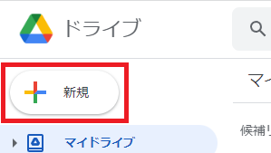
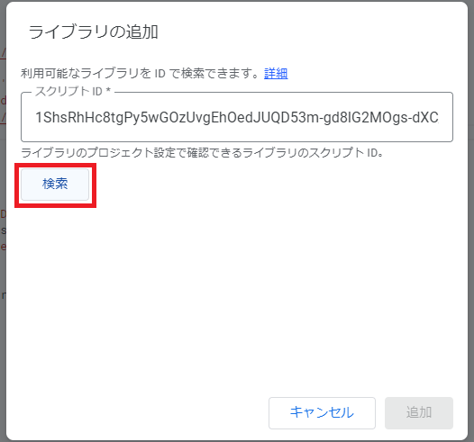
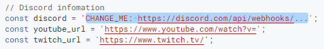

# Youtube/Twitch Live通知botの作成方法

## はじめに
このbotを作成することで、以下のようにDiscordにチャンネルの通知を流せます。  
  

ざっくり手順を並べると、  
①DiscordでWebhookのURLを発行  
②Googleスプレッドシートを作成  
③Google Apps Scriptsの作成  
をすることでDiscordに通知を投稿することが出来ます。  

現在、Youtubeの動画投稿/配信予約/配信開始、Twitchの配信開始に対応しています。  
以下より詳細な環境構築手順を記載します。  

## WebhookのURL発行
Webhookは、Scriptから任意のメッセージを任意のDiscordチャンネルに流すために使用します。

1. Discordの「サーバー設定」を開く  
2. 「連携サービス」を選択  
3. 「ウェブフックを作成」を選択  

4. 「ウェブフックを作成」を選択  

5. 出来上がったbotを選択し、通知を投稿するテキストチャンネルを設定  

6. 「ウェブフックURLをコピー」を選択  

7. コピーしたURLをメモ帳などに貼り付けて保持しておく  
※このあと実施する手順がうまくいかない場合は、こちらのURLを教えていただければ鈴音舞夢側でも環境構築可能です。  
　（でもご本人がbotの管理をできた方が何かと都合が良いと思います。）

## スプレッドシートの作成
スプレッドシートは、Scriptが取得したYoutubeの情報を集計するために使用します。

1. Googleドライブを開く  
2. 「新規」を選択  

3. 「Googleスプレッドシート」を選択  

4. 作成したスプレッドシートのURLの**青字部分**をコピー  

5. コピーしたIDをメモ帳などに貼り付けて保持しておく  

## Google Apps Scriptの作成
Google Apps Scriptでは、定期的にYoutubeに動画情報を取得しにいき、Webhookへメッセージを送信します。  
地味に手順多めなので、分からないことなどありましたらお気軽に問い合わせください。

### 新規プロジェクト作成
1. Googleドライブを開く  
2. 「新規」を選択  

3. 「Google Apps script」を選択  


### プロジェクトの設定

1. 「コード.gs」の名前を「main.gs」に変更  
  
  
  

2. 以下からソースコードをコピー&ペースト  
[main.gs](main.gs)  
  

3. 「ライブラリを追加」を選択  
  

4. スクリプトIDを入力し、「検索」を選択  
スクリプトID: ``1ShsRhHc8tgPy5wGOzUvgEhOedJUQD53m-gd8lG2MOgs-dXC_aCZn9lFB``  
  

5. **IDが「dayjs」であることを確認して**、「追加」を選択  
  

6. 「サービスを追加」を選択  
  

7. 一覧から「YouTube Data API v3」を選択  
8. **IDが「YouTube」であることを確認して**、「追加」を選択  
  

9. main.gsの**14行目**に先ほど作成したWebhookのURLを置き換える  
(下記画像の青字部分を丸々置き換える)
  

10. main.gsの**19行目**に先ほど作成したスプレッドシートのIDを置き換える  
(下記画像の青字部分を丸々置き換える)
  

11. 通知したいチャンネルの情報を置き換える  
  
\<例\>  
※YoutubeのIDは初期のURLをサポートしています！  
　チャンネルURLが`https://www.youtube.com/channel/UCg3tKEUFef2R-wQ-hRahkiQ`の場合、後ろの`UCg3tKEUFef2R-wQ-hRahkiQ`がIDになります。  
※チャンネル名は、Discordに通知するときのユーザー名なので、必ず一致しなくても大丈夫です！  
　プログラムの都合上、**名前が被らないように**設定をお願いします！  
    ```json
    const youtube_channels = {
        'UCFpxoltilHCmuHWeERqsUlA': '椿鬼いろは',
        'UCOZe-9ocT5PtsWTHsYKGxAw': '仮想娘ぴま',
        'UC46XRyRrZcNIFdiqAvMUjfQ': 'ふぇにー',
        'UClzPnQnlA2hxxU_MATRdVew': 'Rog / Rおじ',
        'UCVh7n8e01PTaXobSrJeGAKg': '雨宮レイナ',
        'UCg3tKEUFef2R-wQ-hRahkiQ': '鈴音舞夢(Youtube)'
    };

    const twitch_channels = {
        'suzunemaimu': '鈴音舞夢(Twitch)',
        'carneinu': 'かるね犬'
    };
    ```

### 定期実行の設定

1. 左の一覧から「トリガー」 を選択  
  

2. 「新しいトリガーを作成します」を選択   
  

3. 以下の画像のように設定し、「保存」を選択  
※ここで「store」関数が表示されない場合は、main.gsの「実行」を1回押してください  
※時間間隔などは任意に設定できます。ただし、Youtube Data APIには1日の使用回数上限が存在したはずなので超えないようにご注意ください  
  

4. スクリプトがYoutube Data APIを使用するのに使用者のGoogleアカウントから許可がいるため、手続きを行う  
※「Unsafe」と書いてありますが、自分のスクリプトを自分のGoogleアカウントで使用することを許可するだけなので大丈夫です  
  
  
  
  

5. 1行表示されれば完了
  

### プロジェクトのデプロイ

1. 画面右上の「デプロイ」を選択  
2. 「新しいデプロイ」を選択  
  

3. 歯車マークより「ウェブアプリ」を選択  
  

4. 「デプロイ」を選択  
  

## さいごに
以上の手順で、チャンネル通知がDiscordのチャットに流れるように設定できたはずです。  
トラブルシューティングは鈴音舞夢までお問い合わせください。  

Youtubeの配信通知部分でかなりお世話になってるソースコードです！ありがとうございます！  
[youtube2discord](https://github.com/Tkg-tamagohan/youtube2discord)  

参考記事です！ありがとうございます！  
[GASで推しのYouTubeチャンネルの更新をDiscordに通知する](https://qiita.com/tkgtamagohan/items/74d011b9fe0599d8279c)
